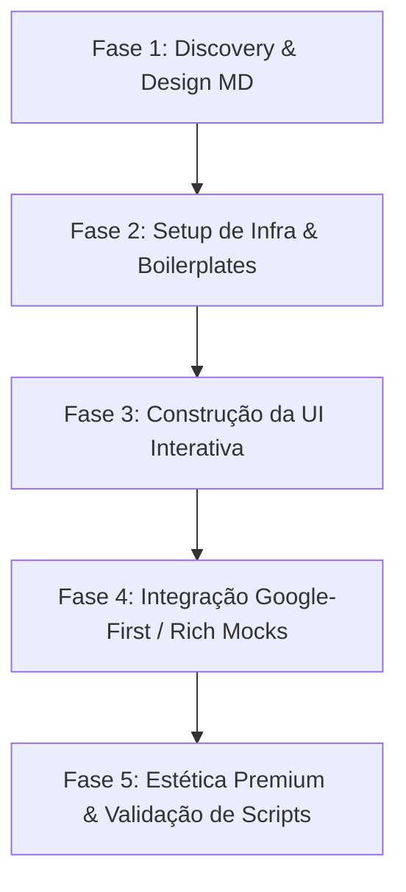

# AG47 Hyper-Prototyping (Google Ecosystem)

Esta skill define as diretrizes, boilerplates estruturais e comandos rápidos para realizar **prototipagem hiper-rápida** e de **altíssimo padrão visual** (padrão de elite Agência 47) utilizando a stack **Next.js (App Router), Tailwind CSS, shadcn/ui, Framer Motion e Google Firebase (Google-First)**.

Ela é inspirada na filosofia de codificação autônoma de extrema velocidade (estilo Karpathy/Claude Code), traduzida e otimizada para o modelo **Gemini** dentro do ecossistema Antigravity.

---

## 🎯 Diretrizes de Acionamento (Triggers)
Use esta skill sempre que o usuário solicitar:
- "Criar um clone de X rápido" (ex: "um clone do Nubank", "um dashboard de cripto")
- "Prototipar um aplicativo do zero"
- "Criar uma prova de conceito (PoC) interativa"
- "Fazer uma integração rápida com Firebase / Google Cloud"
- "Configurar um MVP funcional com autenticação e banco de dados"

---

## 1. Os 5 Pilares do Hyper-Prototyping (Karpathy & Gemini Adapted)

### 1.1 Entendimento Explícito e Contexto Profundo
Aproveite ao máximo a massiva janela de contexto do Gemini para ler a estrutura completa e prever dependências antes de gerar qualquer linha de código. Se a solicitação for minimamente ambígua, ative o **Socratic Gate** (mínimo de 3 perguntas táticas). **Não assuma regras de negócio cruciais.**

### 1.2 Mudanças Cirúrgicas e Isolamento (P0)
Modifique apenas os arquivos estritamente necessários para a funcionalidade pedida. Ao prototipar novas aplicações dentro do diretório `/labs/` ou subpastas do sandbox, crie estruturas limpas e isoladas, mantendo a integridade total do restante do ecossistema do projeto.

### 1.3 Stack "Google First" Nativa
Evite intermediários terceiros (como Supabase, Clerk ou Vercel KV) a menos que explicitamente solicitado. A resposta padrão para backend em MVPs é a suite **Google Cloud / Google Firebase**:
- **Front-end**: Next.js 16 (App Router + Turbopack) + Tailwind CSS + shadcn/ui + Framer Motion.
- **Back-end/Banco/Auth**: Firebase Authentication + Cloud Firestore + Cloud Storage.

### 1.4 Estética Premium "Labs Blueprint" (Não-MVP Visual)
Na Agência 47, um protótipo funcional deve parecer um produto de produção final de luxo no primeiro segundo.
- **Cores**: Use paletas HSL coordenadas, fundos escuros profundos (`#000000`, `#050505`) e gradientes suaves de neon (ex: ciano, azul-cobalto, esmeralda). Proibido usar cores planas básicas ou botões cinzas feios.
- **Glassmorphism**: Aplique classes de desfoque de fundo avançadas (`backdrop-blur-xl bg-white/5 border border-white/10`).
- **Bento Grids & Stickers**: Organize painéis e dashboards em Bento Boxes, com marca d'água de fontes mono com opacidade ultra baixa (3-5%) em camadas secundárias para passar ar técnico.

### 1.5 Validação Contínua
Valide rigorosamente a tipagem TypeScript, separe componentes de cliente e servidor (`"use client"`) e execute os scripts de análise de código locais (`checklist.py`) antes de dar uma tarefa por encerrada.

---

## 2. Boilerplates Rápidos (Prontos para Reúso)

Para acelerar drasticamente o desenvolvimento, use estes blocos de código robustos e bem estruturados como fundação:

### 2.1 Inicialização do Firebase Client (`lib/firebase.ts`)
Crie este arquivo para expor instâncias compartilhadas e performáticas dos serviços do Firebase:

```typescript
import { initializeApp, getApps, getApp } from "firebase/app";
import { getAuth } from "firebase/auth";
import { getFirestore } from "firebase/firestore";
import { getStorage } from "firebase/storage";

const firebaseConfig = {
  apiKey: process.env.NEXT_PUBLIC_FIREBASE_API_KEY,
  authDomain: process.env.NEXT_PUBLIC_FIREBASE_AUTH_DOMAIN,
  projectId: process.env.NEXT_PUBLIC_FIREBASE_PROJECT_ID,
  storageBucket: process.env.NEXT_PUBLIC_FIREBASE_STORAGE_BUCKET,
  messagingSenderId: process.env.NEXT_PUBLIC_FIREBASE_MESSAGING_SENDER_ID,
  appId: process.env.NEXT_PUBLIC_FIREBASE_APP_ID,
};

// Inicialização segura para Next.js (evita múltiplas instâncias no Server-Side Rendering)
const app = getApps().length > 0 ? getApp() : initializeApp(firebaseConfig);

export const auth = getAuth(app);
export const db = getFirestore(app);
export const storage = getStorage(app);
export default app;
```

### 2.2 Hook Customizado de Autenticação React (`hooks/useAuth.tsx`)
Crie um Context Provider para propagar de forma reativa o estado do usuário do Firebase pela interface cliente:

```tsx
"use client";

import React, { createContext, useContext, useEffect, useState } from "react";
import { onAuthStateChanged, User, signOut as firebaseSignOut } from "firebase/auth";
import { auth } from "@/lib/firebase";

interface AuthContextType {
  user: User | null;
  loading: boolean;
  logout: () => Promise<void>;
}

const AuthContext = createContext<AuthContextType>({
  user: null,
  loading: true,
  logout: async () => {},
});

export const AuthProvider = ({ children }: { children: React.ReactNode }) => {
  const [user, setUser] = useState<User | null>(null);
  const [loading, setLoading] = useState(true);

  useEffect(() => {
    const unsubscribe = onAuthStateChanged(auth, (currentUser) => {
      setUser(currentUser);
      setLoading(false);
    });
    return () => unsubscribe();
  }, []);

  const logout = async () => {
    await firebaseSignOut(auth);
  };

  return (
    <AuthContext.Provider value={{ user, loading, logout }}>
      {!loading && children}
    </AuthContext.Provider>
  );
};

export const useAuth = () => useContext(AuthContext);
```

### 2.3 Layout Premium Glassmorphism Bento Card (`components/BentoCard.tsx`)
Use este componente para estruturar o visual de dashboards com efeitos de hover polidos:

```tsx
"use client";

import React from "react";
import { motion } from "framer-motion";
import { cn } from "@/lib/utils";

interface BentoCardProps extends React.HTMLAttributes<HTMLDivElement> {
  children: React.ReactNode;
  delay?: number;
}

export const BentoCard = ({ children, className, delay = 0, ...props }: BentoCardProps) => {
  return (
    <motion.div
      initial={{ opacity: 0, y: 20 }}
      animate={{ opacity: 1, y: 0 }}
      transition={{ duration: 0.5, delay, ease: "easeOut" }}
      whileHover={{ y: -4, scale: 1.01 }}
      className={cn(
        "relative overflow-hidden rounded-2xl border border-white/10 bg-black/40 backdrop-blur-xl p-6 shadow-2xl transition-all duration-300 hover:border-white/20 hover:shadow-cyan-500/5",
        className
      )}
      {...props}
    >
      {/* Background glow sutil */}
      <div className="absolute -right-20 -top-20 -z-10 h-40 w-40 rounded-full bg-cyan-500/10 blur-[80px]" />
      {children}
    </motion.div>
  );
};
```

---

## 3. Comandos Rápidos e Automação de Setup

Durante a execução da tarefa, aplique estes comandos ágeis com parâmetros pré-configurados e não-interativos:

### 3.1 Inicialização Básica de Componentes (shadcn/ui)
```powershell
# Instalação rápida de componentes essenciais sem perguntas
npx -y shadcn@latest add dialog button input card tabs drawer --overwrite
```

### 3.2 Dependências de Performance e Animação
```powershell
# Instalar bibliotecas recomendadas de alta-fidelidade
npm install framer-motion lucide-react canvas-confetti clsx tailwind-merge
```

### 3.3 Rodar Servidores de Desenvolvimento Isolados
Sempre que rodar subprojetos na pasta `/labs/`, utilize portas explícitas e isoladas para evitar conflitos:
```powershell
# Rodar na porta 3001
npm --prefix labs/digital-bank run dev -- -p 3001
```

---

## 4. Resolução de Conflitos e Gerenciamento de Processos (Troubleshooting)

### 4.1 Erro `EADDRINUSE` (Endereço já está em uso)
Se o terminal falhar ao inicializar o servidor de desenvolvimento com o erro `listen EADDRINUSE: address already in use :::3001`, você **deve** usar o utilitário embutido da skill para liberar a porta antes de tentar novamente.

Execute o script de gerenciamento de portas:
```powershell
# Execução no Windows (PowerShell/CMD) ou Unix via Python
python .agent/skills/ag47-hyper-prototyping/scripts/port_manager.py 3001
```

*Nota: O script identificará automaticamente o PID que está travando a porta e encerrará o processo de forma segura, permitindo que a nova instância do Next.js suba sem impedimentos.*

---

## 5. Fluxo de Trabalho de Prototipagem Extrema (5 Fases)

Siga este roteiro cirúrgico para atingir a "velocidade absurda" exigida:



1. **Fase 1: Discovery & Design MD**
   Valide os requisitos através do Socratic Gate. Crie ou atualize o plano de implementação (`implementation_plan.md`) definindo claramente a árvore de arquivos.
2. **Fase 2: Setup de Infra & Boilerplates**
   Inicialize as dependências e escreva os arquivos de conexão estruturais (Firebase, hooks e utilitários globais).
3. **Fase 3: Construção da UI Interativa**
   Crie a casca visual do dashboard ou clone utilizando Bento Cards com animações suaves e layouts 100% responsivos.
4. **Fase 4: Integração Google-First / Rich Mocks**
   Conecte as ações de formulário e cliques ao Firestore/Auth. Se o banco final ainda não estiver disponível, monte dados de mock ricos e realistas (ex: histórico de transações reais, nomes reais, valores financeiros válidos). Evite usar dados genéricos como `Lorem Ipsum` ou `teste123`.
5. **Fase 5: Estética Premium & Validação de Scripts**
   Faça um polimento visual refinado (neon shadows, custom scrolls, active states). Rode o script de checklists (` checklist.py`) e finalize a documentação com o `walkthrough.md`.

---
