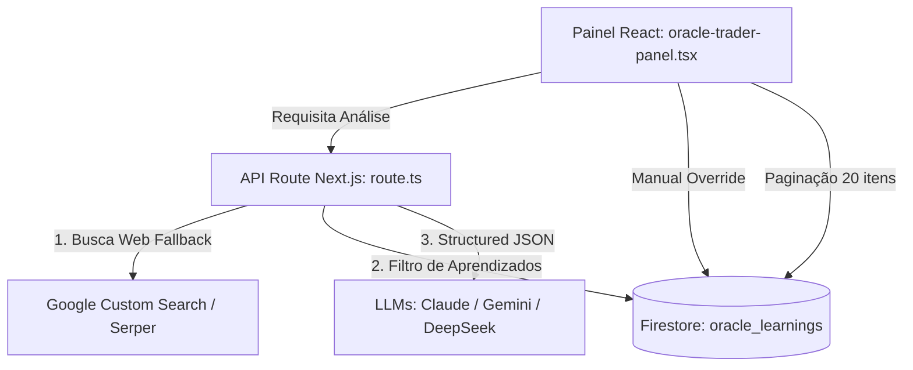

# Plano de Execução - Melhorias Oracle Trader v4

Este plano estabelece a estratégia detalhada para implementar melhorias de assertividade preditiva, otimização de custo e robustez de interface no mini-app **Oracle Trader Football** (`/labs/oracle-trader`).

---

## 🎯 Critérios de Sucesso

1. **Assertividade:** Modelos não-nativos em busca (como DeepSeek e outros via OpenRouter) devem ter acesso a dados em tempo real da web por meio de fallback de busca.
2. **Eficiência Cognitiva:** A IA deve receber aprendizados passados relevantes ao jogo atual, superando a barreira estática dos últimos 5 itens genéricos.
3. **Controle Operacional:** O operador humano deve poder corrigir classificações de ex-post errôneas feitas pela IA.
4. **Eficiência de Custos:** Resolução de placares finais não deve consumir chamadas caras e demoradas de LLMs com grande contexto.
5. **Escabilidade:** Listagens do Ledger e Aprendizados paginados para evitar lentidão e custos desnecessários do Firebase.

---

## 🏗️ Proposta de Arquitetura & Alterações

---

## 📂 Arquivos Afetados

- `[MODIFY]` [route.ts](file:///c:/Users/moise/Desktop/Agencia47/DEV/DEVELOPING/SANDBOX/Ag47.pt/app/api/oracle/route.ts) — Ingestão estruturada de buscas, injeção filtrada de aprendizados e suporte a JSON estruturado.
- `[MODIFY]` [oracle-trader-panel.tsx](file:///c:/Users/moise/Desktop/Agencia47/DEV/DEVELOPING/SANDBOX/Ag47.pt/labs/oracle-trader-footboll/oracle-trader-panel.tsx) — Paginação do Firebase, modal de edição com override da classificação e reestruturação do prompt inicial.

---

## 📝 Detalhamento das Tarefas (Task Breakdown)

### Fase 1: Backend & Inteligência (Assertividade & Custos)

#### Task 1.1: Web Search Fallback para Provedores Não-Nativos

- **Agente:** `backend-specialist`
- **Skill:** `api-patterns`
- **Prioridade:** P0
- **Dependências:** Nenhuma
- **INPUT:** Seleção de modelo DeepSeek/OpenRouter que não possui parâmetro de ferramenta nativo de busca em [route.ts](file:///c:/Users/moise/Desktop/Agencia47/DEV/DEVELOPING/SANDBOX/Ag47.pt/app/api/oracle/route.ts).
- **OUTPUT:** Integração de uma chave de busca via Serper API ou Google Custom Search como fallback no backend, alimentando o prompt com os snippets de busca antes de enviar para o modelo.
- **VERIFY:** Executar análise com DeepSeek selecionado e verificar nos logs do servidor que dados reais do jogo foram injetados no contexto.

#### Task 1.2: Filtragem Contextual de Aprendizados

- **Agente:** `backend-specialist`
- **Skill:** `database-design`
- **Prioridade:** P1
- **Dependências:** Nenhuma
- **INPUT:** Array completo de `learnings` enviado pelo frontend em [route.ts](file:///c:/Users/moise/Desktop/Agencia47/DEV/DEVELOPING/SANDBOX/Ag47.pt/app/api/oracle/route.ts).
- **OUTPUT:** Substituição de `.slice(0, 5)` por uma filtragem que busca correspondência de nomes dos times (ex: "Brasil", "Argentina") ou palavras-chave contidas no confronto nos aprendizados. Caso nenhum aprendizado específico seja encontrado, retorna os 5 aprendizados mais recentes como fallback.
- **VERIFY:** Passar um confronto como "Flamengo x Fluminense" e verificar se aprendizados históricos sobre "Flamengo" ou "clássicos" são injetados preferencialmente em vez de aprendizados genéricos sobre "Copa do Mundo".

#### Task 1.3: Otimização de Custos de Resolução

- **Agente:** `backend-specialist`
- **Skill:** `clean-code`
- **Prioridade:** P1
- **Dependências:** Task 1.1
- **INPUT:** Chamada de resolução de resultado `fetchResult` em [oracle-trader-panel.tsx](file:///c:/Users/moise/Desktop/Agencia47/DEV/DEVELOPING/SANDBOX/Ag47.pt/labs/oracle-trader-footboll/oracle-trader-panel.tsx).
- **OUTPUT:** Backend intercepta requisições de resolução e força o uso de um modelo ultra-leve (`google:gemini-2.5-flash` ou similar) sem o system prompt da skill para economizar tokens e reduzir a latência de verificação.
- **VERIFY:** Medir o tempo de resposta do "Buscar Result" e validar que o modelo utilizado no log da rota foi o modelo rápido/leve.

#### Task 1.4: Structured Output Nativo

- **Agente:** `backend-specialist`
- **Skill:** `nextjs-react-expert`
- **Prioridade:** P1
- **Dependências:** Nenhuma
- **INPUT:** Chamada da API em [route.ts](file:///c:/Users/moise/Desktop/Agencia47/DEV/DEVELOPING/SANDBOX/Ag47.pt/app/api/oracle/route.ts).
- **OUTPUT:** Configuração de JSON schema nativo nas requisições do Gemini e uso de system-level instructions estruturadas no Anthropic para impedir que a resposta saia quebrada ou com tags markdown extras.
- **VERIFY:** Rodar 10 análises consecutivas e verificar que nenhuma apresentou erro de parsing de JSON no frontend.

---

### Fase 2: Frontend & Interface (Controle & Escalar)

#### Task 2.1: Edição Manual da Classificação Causal (Fator Humano)

- **Agente:** `frontend-specialist`
- **Skill:** `frontend-design`
- **Prioridade:** P0
- **Dependências:** Nenhuma
- **INPUT:** Modal de edição `editingPred` em [oracle-trader-panel.tsx](file:///c:/Users/moise/Desktop/Agencia47/DEV/DEVELOPING/SANDBOX/Ag47.pt/labs/oracle-trader-footboll/oracle-trader-panel.tsx).
- **OUTPUT:** Adição de um campo `<select>` ou botões interativos contendo as categorias de `CLASS_META` (`correct_read`, `lucky_win`, `variance_loss`, `misread`, `missing_info`) permitindo que o operador corrija manualmente o veredito ex-post do robô no banco de dados.
- **VERIFY:** Abrir o modal de edição de um jogo resolvido, alterar a classificação de "Variância" para "Leitura errada", salvar e ver o badge mudar imediatamente na listagem.

#### Task 2.2: Paginação dos Dados do Ledger e Aprendizados (Firestore)

- **Agente:** `frontend-specialist`
- **Skill:** `nextjs-react-expert`
- **Prioridade:** P2
- **Dependências:** Nenhuma
- **INPUT:** Consultas Firebase Firestore em [oracle-trader-panel.tsx](file:///c:/Users/moise/Desktop/Agencia47/DEV/DEVELOPING/SANDBOX/Ag47.pt/labs/oracle-trader-footboll/oracle-trader-panel.tsx).
- **OUTPUT:** Alteração do fetching inicial para trazer apenas 20 documentos de `oracle_predictions` e `oracle_learnings`, adicionando um botão estilizado "Carregar Mais" que faz a busca dos próximos registros.
- **VERIFY:** Inserir 25 registros de teste, certificar-se de que apenas 20 são exibidos inicialmente, clicar em "Carregar Mais" e ver os 5 restantes aparecerem de forma fluida.

#### Task 2.3: Guiamento Estruturado de Pesquisa

- **Agente:** `frontend-specialist`
- **Skill:** `clean-code`
- **Prioridade:** P2
- **Dependências:** Nenhuma
- **INPUT:** Geração de prompt em `generatePrediction` no [oracle-trader-panel.tsx](file:///c:/Users/moise/Desktop/Agencia47/DEV/DEVELOPING/SANDBOX/Ag47.pt/labs/oracle-trader-footboll/oracle-trader-panel.tsx).
- **OUTPUT:** Reestruturação do prompt do jogo para incluir queries explícitas sugeridas para a pesquisa da IA, otimizando as buscas em tempo de execução.
- **VERIFY:** Verificar no histórico de chamadas que as queries enviadas para busca web estão estruturadas e focadas.

---

## 🏁 Plano de Verificação (Phase X)

- [ ] Validar chaves de ambiente no `.env.local` para fallbacks de busca (ex: Serper/Google Search).
- [ ] Executar `npm run lint` para garantir que as modificações no TSX mantêm as regras de tipagem intactas.
- [ ] Testar a pipeline de ponta a ponta:
  - [ ] Buscar jogos do dia (aba "HOJE").
  - [ ] Analisar um jogo usando modelo nativo com busca (Gemini/Claude).
  - [ ] Analisar um jogo usando modelo não-nativo (DeepSeek/OpenRouter) e validar injeção de busca.
  - [ ] Buscar resultado de um jogo finalizado (validar custo/latência).
  - [ ] Salvar aprendizado ex-post, editar sua classificação e verificar a injeção do aprendizado contextualmente em uma partida futura similar.
- [ ] Compilar build de produção (`npm run build`) com sucesso antes de qualquer deploy.
