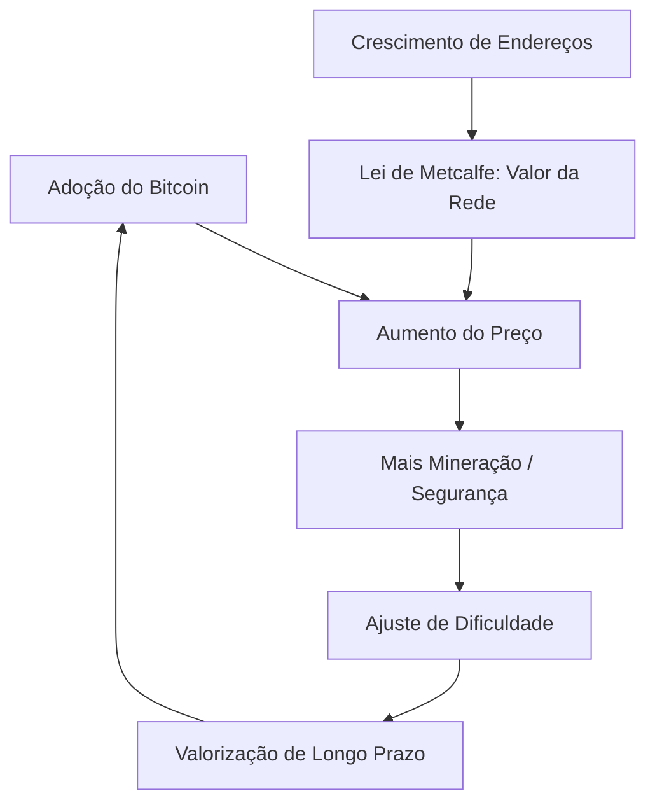

# Lições de Mercado: O Modelo Power Law do Bitcoin (Giovanni Santostasi)

Este documento sintetiza os aprendizados extraídos do vídeo **"Astrophysicist discovered Bitcoin's secret pattern"** com o astrofísico e neurocientista Giovanni Santostasi, focado no **Modelo de Lei de Potência do Bitcoin (Bitcoin Power Law - BPL)**. Estas diretrizes servem como base teórica e matemática para o Swarm de Agentes do Apex.

---

## 1. Visão Geral do Modelo Power Law

O Modelo Power Law propõe que o crescimento do Bitcoin não é governado por bolhas especulativas aleatórias, mas sim por leis físicas e biológicas de crescimento de rede e auto-organização. 

Diferente de modelos exponenciais tradicionais (como o finado Stock-to-Flow, que prevê crescimento infinito e preços irreais a curto prazo), a Lei de Potência modela uma **desaceleração natural do crescimento à medida que a rede amadurece**, mantendo um comportamento previsível a longo prazo.

### A Equação Matemática
A relação fundamental é expressa como:

$$\text{Preço} = A \times (\text{Dias desde o Bloco Gênese})^n$$

Onde:
*   **Dias desde o Bloco Gênese:** Tempo decorrido desde 3 de janeiro de 2009.
*   **$A$ (Constante de escala):** Aproximadamente $10^{-17}$ (ou valor ajustado de calibração).
*   **$n$ (Expoente de Potência):** Medido empiricamente entre **$5.8$ e $5.9$** (frequentemente arredondado para $6$).

### A Escala Log-Log
Para visualizar essa linearidade, o modelo plota o gráfico em uma escala **Log-Log** (onde tanto o eixo vertical de preço quanto o eixo horizontal de tempo são logarítmicos). 
*   Em gráficos semi-logarítmicos (apenas preço em log), a curva do Bitcoin começa a curvar para baixo devido à perda de momentum.
*   Em uma escala log-log, a trajetória histórica do Bitcoin se transforma em uma **linha reta quase perfeita**, com um coeficiente de determinação ($R^2$) superior a **0.97**.

---

## 2. A "Biologia" e Termodinâmica do Mercado

Santostasi compara o Bitcoin a sistemas naturais complexos (cidades, organismos biológicos, redes neurais e galáxias). O crescimento segue dinâmicas biológicas sustentadas por dois loops de feedback fundamentais:

### O Loop de Demanda: Lei de Metcalfe
*   O valor de uma rede de telecomunicações ou social é proporcional ao quadrado do número de usuários conectados ($V \propto N^2$).
*   À medida que mais endereços ativos entram na rede, a utilidade e o valor financeiro do Bitcoin escalam de forma não linear (quadrática).

### O Loop de Oferta: Dificuldade e Escassez
*   O ajuste de dificuldade (a cada 2016 blocos) funciona como um termostato termodinâmico. 
*   Conforme o preço sobe, atrai mais poder computacional (Hash Rate), o que aciona o aumento da dificuldade, garantindo a emissão fixa de novos blocos em ~10 minutos e aumentando o custo marginal de produção e a segurança física da rede.

---

## 3. O Canal de Escala e as Três Linhas de Tendência

O modelo define um canal matemático rígido com limites de suporte e resistência:

1.  **Linha de Suporte Inferior (Floor):**
    *   Representa o valor mínimo absoluto do Bitcoin com base na infraestrutura física e de segurança instalada.
    *   Historicamente, o fechamento diário do preço do Bitcoin **nunca quebrou** esta linha de suporte, mesmo nas piores capitulações.
2.  **Valor Justo (Fair Value):**
    *   A linha central do modelo de regressão linear Log-Log. Representa o centro de gravidade para onde o preço sempre tende a retornar quando cessa a mania especulativa.
3.  **Linha de Resistência Superior (Peak Line):**
    *   Representa o teto das bolhas de curto prazo impulsionadas por euforia. Note que o pico das bolhas cresce mais lentamente a cada ciclo, convergindo de volta para a linha média.

---

## 4. O Efeito da "Dobradinha" do Tempo ($2^6$)

Uma das propriedades mais poderosas da Lei de Potência com expoente próximo de $6$ é a previsibilidade do multiplicador:

*   Se dobrarmos a idade da rede (multiplicar o tempo desde o bloco gênese por $2$), o preço do Bitcoin tende a multiplicar por $2^6$ (ou $2^{5.8}$):
    $$2^{5.8} \approx 55.7 \quad \text{e} \quad 2^6 = 64$$
*   **Exemplo Prático:**
    *   Se aos 10 anos de idade a rede tinha um determinado valor justo, aos 20 anos de idade (previsto para meados de 2029) o valor justo estimado estará aproximadamente **60 vezes maior**.

---

## 5. Diretrizes de Implementação para os Agentes Apex

Para garantir previsões realistas e não simuladas, os agentes de análise e trading do Swarm devem usar as seguintes heurísticas baseadas neste modelo:

*   **Evitar Vieses Exponenciais de Curto Prazo:** Os agentes não devem prever alta infinita e imediata. As previsões anuais devem utilizar o **Fair Value** do modelo Power Law como âncora matemática de longo prazo.
*   **Cálculo Dinâmico de Suporte/Resistência:** Em vez de usar apenas médias móveis simples, os agentes devem calcular os limites superior e inferior do canal Power Law para o dia atual baseado na fórmula de Santostasi:
    $$\text{Price}_{\text{Fair}} = 10^{-17} \times \text{Days}^{5.8}$$
*   **Monitoramento de Desvios (Z-Score):** O desvio do preço atual em relação ao Fair Value indica se o mercado está sobrecomprado (aproximando-se da resistência superior do canal) ou subvalorizado (próximo ao suporte de ferro).
