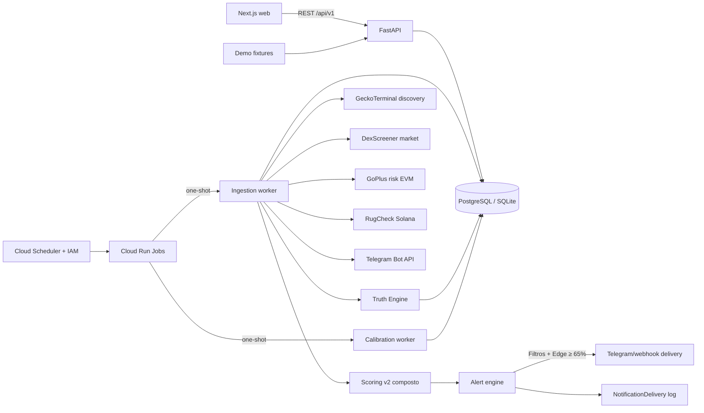

# Arquitetura

## Contexto e fronteiras

O Radar é um produto independente dentro de `labs` para preservar o site Ag47.pt e os laboratórios existentes.

### Filosofia: O Lóbulo Especializado (Organismo Cognitivo)

O Radar não é um sistema monolítico desenhado para saber de tudo; ele é um **lóbulo especializado** (o "cardiologista" de altcoins) que alimentará um futuro **Organismo Cognitivo AG47**.
Ele não mistura geopolítica ou economia com crypto. A arquitetura é construída para que o Radar extraia, processe e normalize **Conhecimento** e sirva esse conhecimento estruturado via API. No futuro, um LLM integrador fará o raciocínio cruzado consumindo a interface pública deste e de outros lóbulos.

### Princípio Epistemológico

Nenhuma informação é descartada. Todo dado observado deve evoluir para conhecimento reutilizável. O fluxo de dados opera com separação estrita entre observação empírica e interpretação:

```text
Snapshot (O que é) -> Event (O que mudou) -> Signal (Significado básico) -> Hypothesis (Conclusão provável) -> Validation (Avaliação) -> Knowledge (Padrão comprovado)
```

A UI nunca acessa providers externos diretamente. FastAPI concentra normalização, persistência, explicabilidade, validação de hipóteses e proteção de segredos.



## Componentes

### Web

- App Router com layouts e páginas como Server Components por padrão.
- Um provider cliente estreito fornece TanStack Query e contexto de filtros globais.
- Zod valida respostas recebidas antes que dados alcancem componentes.
- A tabela usa TanStack Table; gráficos usam Recharts carregado apenas nos painéis necessários.
- Loading, error, empty, partial, stale e demo são estados explícitos, não variações cosméticas de sucesso.
- A Inbox (`alert-inbox.tsx`) possui um visualizador expansível do breakdown do score por componente (DexScreener, GoPlus, RugCheck, Holders, Liquidez/Volume).
- O portal público usa um BFF GET-only e expõe Diagnóstico, Filtros de Notificação e Histórico de Entregas somente para leitura. Ações de operador ficam desabilitadas até existir autenticação server-side própria.

### API

- Rotas HTTP ficam finas e delegam consultas, scoring, alertas e ingestão a serviços.
- Pydantic valida entradas e respostas (`schemas.py`); um envelope de erro inclui código e request ID sem stack trace.
- O prefixo público é `/api/v1`; `/health` permanece simples para orquestradores.
- Endpoints principais de leitura: `/tokens`, `/alerts`, `/alerts/edge-inbox`, `/truths/stats`, `/system/status` e `/system/notifications`. Mutações como reset de provider e configurações exigem chave operator/admin e não atravessam o BFF público.
- A ingestão não é acionada por endpoint público nem pelo `lifespan`; workers one-shot separados são disparados por infraestrutura autenticada.
- CORS aceita somente origens configuradas e as mutações de watchlist usam limite por IP/janela.

### Persistência

- `Token` e `TradingPair` formam as identidades estáveis.
- Snapshots de mercado, social e risco são append-only para preservar procedência e evolução.
- `OpportunityScore` armazena pesos derivados, confiança, explicação e versão do algoritmo.
- `Alert` possui chave de deduplicação, janela configurável, campo `confidence` (`low | medium | high | critical`) e `truth_status` (`true_positive | false_positive | inconclusive`).
- `NotificationDelivery` regista uma entrega por alerta/canal, com status durável (`pending | sending | success | dead`), payload, tentativas, próximo horário e erros. Integrações não configuradas são ignoradas antes de criar uma entrega; falhas reais reutilizam a mesma linha, respeitam backoff persistente e encerram após três tentativas.
- `UserNotificationSettings` persiste os filtros configurados pelo operador (`min_severity`, `min_confidence`, `allowed_chains`).
- `ScoringWeights` persiste as matrizes de calibração dinâmica geradas pelo backtest periódico.
- `JobRun` regista chave idempotente, tentativas, resultado e horário das execuções externas.
- `TokenTruth` armazena os resultados de retrospecção do Truth Engine para feedback loop.
- `WatchlistEntry` é única por token e persiste em banco.
- Endereços EVM têm uma representação normalizada em lowercase para unicidade; endereços Solana preservam case.

PostgreSQL usa `TIMESTAMPTZ`; o fallback SQLite é normalizado para UTC na borda da aplicação. Índices cobrem identidades, FKs, timestamps de captura, score, deduplicação e `truth_status`.

## Fluxo de dados

1. GeckoTerminal retorna pools criados nas últimas 48 horas por rede habilitada.
2. A normalização rejeita itens inválidos, preserva erros parciais e deduplica por `chain + pair_address`.
3. DexScreener enriquece market data em contratos internos com campos opcionais.
4. GoPlus fornece análise de risco de contrato (honeypot, mintable, blacklist, taxas) para chains EVM. RugCheck cobre Solana.
5. Telegram Bot API ingere sinais de canais configurados (text-only).
6. Cada coleta persiste sua fonte, qualidade, duração e horário UTC.
7. O scoring v2 calcula sub-scores com pesos dinâmicos (calibrados via backtest a cada 12 h) sem transformar ausências em zero seguro. Cold start (< 100 truths) recua para pesos hardcoded.
8. O alert engine aplica filtro de Edge estatístico (win rate ≥ 65% com amostra ≥ 30), suspende por Drawdown (3 falhas consecutivas) e atribui confidence tier.
9. O worker aguarda o dispatcher de alertas, que verifica os `UserNotificationSettings` (severidade mínima, confiança mínima e redes permitidas), registra uma entrega por alerta/canal e agenda retry persistente com backoff. Somente itens vencidos são retomados; a terceira falha encerra o canal em `dead`.
10. O Truth Engine re-avalia tokens após 24 h: price delta ≥ +20% → true_positive; ≤ −30% → false_positive; else → inconclusive.
11. A UI consulta somente a API interna e converte horários para o timezone configurado pelo utilizador.

## Providers

Contratos separados cobrem descoberta, mercado, blockchain, holders, risco, social e entrega de alertas. Todo resultado inclui dados, fonte, coleta, qualidade, erros parciais, duração, modo e estado stale.

| Provider | Tipo | Cadeia | Notas |
|----------|------|--------|-------|
| GeckoTerminal | Descoberta | Multi-chain | Pools < 48 h |
| DexScreener | Mercado | Multi-chain | Enriquecimento de market data |
| GoPlus | Risco | EVM | Honeypot, mintable, blacklist, taxas, lock |
| RugCheck | Risco | Solana | Auditoria de contrato |
| Telegram Bot | Sinais / Alertas | N/A | `getUpdates`, entrega aguardada pelo worker, retry exponencial |
| Demo fixtures | Todos | N/A | NOVA/FARMX/ORBIT/LYNX/PULSE, `source=ag47_demo_fixture` |

O mecanismo HTTP compartilhado possui timeout, retry somente para falhas transitórias, respeito a `Retry-After`, cache TTL e circuit breaker per-provider (estados: CLOSED → OPEN → HALF-OPEN, cooldown 45 s). A UI pública expõe o estado de cada circuito; o reset manual existe apenas na API protegida do operador. Cache real stale pode ser servido como stale; fixtures só são permitidas quando o modo demo foi selecionado explicitamente.

## Tarefas agendadas

Cloud Scheduler chama a API `jobs:run` do Cloud Run com uma service account autorizada. O processo da API web não executa cron. Cada worker termina ao concluir, reutiliza `CLOUD_RUN_EXECUTION` para deduplicar retries e mantém um advisory lock do PostgreSQL durante a unidade de trabalho. SQLite implementa somente o equivalente local em processo e não é um backend de produção.

| Job | Intervalo | Serviço | Descrição |
|-----|-----------|---------|-----------|
| `market-ingestion` | 5 min | `ag47-radar worker ingest` | Busca providers, normaliza, persiste, executa scoring, alerts e Truth Engine |
| `scoring-calibration` | 12 h | `ag47-radar worker calibrate` | Recalcula pesos com base em truths validadas e persiste `ScoringWeights` |

## Decisões principais

- FastAPI separado foi mantido porque ingestão periódica e providers não se encaixam bem em funções efêmeras do Next.
- SQLAlchemy 2 permite o mesmo domínio em PostgreSQL e fallback SQLite sem criar duas implementações.
- Offset pagination é suficiente para o volume do Sprint 1 e permite saltar páginas; keyset fica reservado para escala maior.
- Demo é uma procedência, não um fallback invisível.
- O score é heurístico e explicável; machine learning foi deliberadamente adiado por ausência de histórico confiável.
- Nenhum código do APEX cripto existente foi reutilizado, pois contém sizing e linguagem de execução fora dos limites do Radar.

## Segurança operacional

- Nenhum endpoint de transação existe.
- URLs externas são aceitas apenas após validação de esquema HTTP/HTTPS e origem conhecida.
- O backend não registra secrets nem headers de autenticação.
- O disparo dos jobs usa IAM entre Cloud Scheduler e a API administrativa do Cloud Run; nenhuma chave de scheduler entra no container.
- Erros inesperados são correlacionados por request ID e retornam mensagem genérica.
- Dependências possuem lock no frontend e instalação reproduzível no backend.
