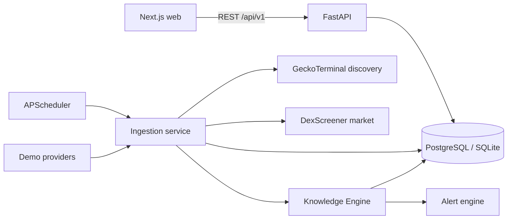

# Arquitetura

## Contexto e fronteiras

O Radar é um produto independente dentro de `labs` para preservar o site Ag47.pt e os laboratórios existentes.

### Filosofia: O Lóbulo Especializado (Organismo Cognitivo)

O Radar não é um sistema monolítico desenhado para saber de tudo; ele é um **lóbulo especializado** (o "cardiologista" de altcoins) que alimentará um futuro **Organismo Cognitivo AG47**.
Ele não mistura geopolítica ou economia com crypto. A arquitetura é construída para que o Radar extraia, processe e normalize **Conhecimento** e sirva esse conhecimento estruturado via API. No futuro, um LLM integrador fará o raciocínio cruzado consumindo a interface pública deste e de outros lóbulos.

### Princípio Epistemológico
Nenhuma informação é descartada. Todo dado observado deve evoluir para conhecimento reutilizável. O fluxo de dados opera com separação estrita entre observação empírica e interpretação:
```text
Snapshot (O que é) -> Event (O que mudou) -> Signal (Significado básico) -> Hypothesis (Conclusão provável) -> Validation (Avaliação) -> Knowledge (Padrão comprovado)
```

A UI nunca acessa providers externos diretamente. FastAPI concentra normalização, persistência, explicabilidade, validação de hipóteses e proteção de segredos.



## Componentes

### Web

- App Router com layouts e páginas como Server Components por padrão.
- Um provider cliente estreito fornece TanStack Query e contexto de filtros globais.
- Zod valida respostas recebidas antes que dados alcancem componentes.
- A tabela usa TanStack Table; gráficos usam Recharts carregado apenas nos painéis necessários.
- Loading, error, empty, partial, stale e demo são estados explícitos, não variações cosméticas de sucesso.

### API

- Rotas HTTP ficam finas e delegam consultas, scoring, alertas e ingestão a serviços.
- Pydantic valida entradas e respostas; um envelope de erro inclui código e request ID sem stack trace.
- O prefixo público é `/api/v1`; `/health` permanece simples para orquestradores.
- CORS aceita somente origens configuradas e as mutações de watchlist usam limite por IP/janela.

### Persistência

- `Token` e `TradingPair` formam as identidades estáveis.
- Snapshots de mercado, social e risco são append-only para preservar procedência e evolução.
- `OpportunityScore` armazena pesos derivados, confiança, explicação e versão do algoritmo.
- `Alert` possui chave de deduplicação e janela configurável.
- `WatchlistEntry` é única por token e persiste em banco.
- Endereços EVM têm uma representação normalizada em lowercase para unicidade; endereços Solana preservam case.

PostgreSQL usa `TIMESTAMPTZ`; o fallback SQLite é normalizado para UTC na borda da aplicação. Índices cobrem identidades, FKs, timestamps de captura, score e deduplicação.

## Fluxo de dados

1. GeckoTerminal retorna pools criados nas últimas 48 horas por rede habilitada.
2. A normalização rejeita itens inválidos, preserva erros parciais e deduplica por `chain + pair_address`.
3. DexScreener enriquece market data em contratos internos com campos opcionais.
4. Cada coleta persiste sua fonte, qualidade, duração e horário UTC.
5. O scoring calcula sub-scores sem transformar ausências em zero seguro.
6. O alert engine compara o estado atual, cria alertas e suprime duplicados dentro da janela.
7. A UI consulta somente a API interna e converte horários para o timezone configurado pelo utilizador.

## Providers

Contratos separados cobrem descoberta, mercado, blockchain, holders, risco, social e entrega de alertas. Todo resultado inclui dados, fonte, coleta, qualidade, erros parciais, duração, modo e estado stale.

O mecanismo HTTP compartilhado possui timeout, retry somente para falhas transitórias, respeito a `Retry-After`, cache TTL e circuit breaker. Cache real stale pode ser servido como stale; fixtures só são permitidas quando o modo demo foi selecionado explicitamente.

## Tarefas agendadas

APScheduler executa sincronização em intervalo configurável apenas quando `SCHEDULER_ENABLED=true`. Um lock em processo impede sobreposição. O MVP pressupõe uma réplica; múltiplas réplicas exigirão worker/lock distribuído em sprint futuro.

## Decisões principais

- FastAPI separado foi mantido porque ingestão periódica e providers não se encaixam bem em funções efêmeras do Next.
- SQLAlchemy 2 permite o mesmo domínio em PostgreSQL e fallback SQLite sem criar duas implementações.
- Offset pagination é suficiente para o volume do Sprint 1 e permite saltar páginas; keyset fica reservado para escala maior.
- Demo é uma procedência, não um fallback invisível.
- O score é heurístico e explicável; machine learning foi deliberadamente adiado por ausência de histórico confiável.
- Nenhum código do APEX cripto existente foi reutilizado, pois contém sizing e linguagem de execução fora dos limites do Radar.

## Segurança operacional

- Nenhum endpoint de transação existe.
- URLs externas são aceitas apenas após validação de esquema HTTP/HTTPS e origem conhecida.
- O backend não registra secrets nem headers de autenticação.
- Erros inesperados são correlacionados por request ID e retornam mensagem genérica.
- Dependências possuem lock no frontend e instalação reproduzível no backend.
