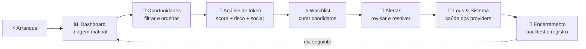

# 🛰️ AG47 Altcoin Radar — Mapa de Uso Diário

> **Documento vivo.** Este é o contrato entre o software e o fluxo de utilização.
> Toda modificação no software que altere qualquer etapa abaixo **deve** atualizar este
> documento na mesma mudança (ver [Registro de impacto](#-registro-de-impacto-no-fluxo)).

| | |
|---|---|
| **Versão do fluxo** | `fluxo-v1.0` |
| **Última revisão** | 2026-08-05 |
| **Modo coberto** | Demo e Live (diferenças sinalizadas com 🎭 / 🔴) |
| **Escopo** | Observacional e read-only — sem carteiras, sem trades |

---

## 🗺️ Visão geral do ciclo diário



---

## ⚡ 0. Arranque (uma vez por sessão)

Com o ambiente Python ativo, na raiz do produto:

```bash
npm run dev
```

| Serviço | URL | Verificar |
|---|---|---|
| Web | <http://localhost:3000> | Shell carrega sem erros |
| API | <http://localhost:8000/health> | `status: ok` |
| OpenAPI | <http://localhost:8000/docs> | Endpoints v1 listados |

**Modo ativo** — a API decide pelo `apps/api/.env` (prefixo `AG47_`):

- 🎭 **Demo** (`AG47_DEMO_MODE=true`, default): fixtures NOVA/FARMX/ORBIT/LYNX/PULSE,
  rotuladas `source=ag47_demo_fixture`. Nenhuma chamada externa.
- 🔴 **Live** (`AG47_DEMO_MODE=false`): GeckoTerminal (descoberta), DexScreener (mercado),
  GoPlus (risco EVM). Social permanece fixture; holders indisponível.

> ⚠️ Dados demo e reais **nunca** se misturam — se um badge de origem parecer ambíguo
> na UI, isso é um bug de fluxo: registrar no [Registro de impacto](#-registro-de-impacto-no-fluxo).

---

## 📊 1. Dashboard — triagem matinal (~5 min)

**Rota:** `/dashboard`

1. Ler a grade de métricas: novos pares, score médio, alertas pendentes.
2. Verificar o gráfico de mercado dos tokens em destaque.
3. Anotar mentalmente os 2–3 tokens que mudaram de classificação desde ontem.

**Perguntas-guia:** _Algo entrou em `oportunidade_forte`? Algum watchlist caiu para `risco_elevado`?_

---

## 🔎 2. Oportunidades — descoberta e filtro (~10 min)

**Rota:** `/oportunidades`

1. Ordenar por **score final** (decrescente) e depois por **volume 1h**.
2. Filtrar por chain se o dia tiver foco (BSC / Ethereum / Solana).
3. Para cada candidato interessante, abrir o detalhe (passo 3).

**Classificações e ação padrão:**

| Classificação | Score | Ação diária |
|---|---|---|
| 🟢 `oportunidade_forte` | ≥ 8.0 | Análise completa + considerar watchlist |
| 🟡 `observar` | ≥ 6.5 | Revisar breakdown; aguardar confirmação |
| 🟠 `especulativo` | ≥ 5.0 | Só analisar se houver sinal social/evento |
| 🔴 `risco_elevado` | < 5.0 ou gate crítico | Não perseguir; entender o porquê no breakdown |

> O score é **explicável**: nunca aceitar o número sem ler os fatores positivos/negativos
> e a **confiança** (dados faltantes reduzem confiança, não são inventados).

---

## 🧪 3. Análise de token — decisão informada (~5 min por token)

No detalhe do token, seguir sempre a mesma ordem:

1. **Score breakdown** — quais componentes puxam para cima/baixo; qual a confiança.
2. **Risco de contrato** — 🔴 em live vem da GoPlus com `flags` auditáveis
   (honeypot, mintable, blacklist, taxas, lock de liquidez). 🎭 Em demo é fixture.
   - Solana aparece como `chain_unsupported` no risco — isso é esperado, não é erro.
3. **Social** — 🎭 sempre fixture no estágio atual; tratar como ilustrativo.
4. **Timeline** — eventos e sinais (`caused_by` liga cada conclusão à observação de origem).

**Regra de ouro:** honeypot ou gate crítico ativo → encerra a análise ali.

---

## ⭐ 4. Watchlist — curadoria (~2 min)

**Rota:** `/watchlist`

- Adicionar apenas tokens que passaram pelo passo 3 completo.
- Remover tokens que caíram para `risco_elevado` ou perderam liquidez.
- A watchlist é o insumo dos alertas — mantê-la enxuta (< 15 tokens) mantém os alertas úteis.

---

## 🔔 5. Alertas — revisão e resolução (~5 min)

**Rota:** `/alertas`

1. Tratar primeiro por severidade: `critico` → `alto_risco` → `atencao` → `informativo`.
2. Para cada alerta: abrir o token, confirmar no breakdown, e **resolver/arquivar** o alerta.
3. Alertas duplicados são deduplicados por janela de 30 min — se aparecerem duplicatas, é bug.

> Entrega externa (email/Telegram/webhook) ainda **não existe** — os alertas vivem só na UI
> e no log estruturado. Não confiar em ser notificado fora da plataforma.

---

## 🧠 6. Logs & Sistema — saúde (~2 min)

**Rotas:** `/logs` e `/configuracoes`

- Conferir status dos providers (ativo/degradado/desativado) e o modo (demo/real).
- Circuit breaker aberto em algum provider real → aguardar cooldown (45 s) antes de re-testar.

---

## 🌙 7. Encerramento do dia — operações CLI

Com o ambiente Python ativo, em `apps/api`:

```bash
python -m ag47_radar.cli ingest --limit 10
```

```bash
python -m ag47_radar.cli backtest --horizon-hours 24
```

- **Ingest** 🔴 (live): garante um ciclo de coleta antes de fechar, acumulando snapshots.
- **Backtest**: mede se o score previu retorno. Enquanto não houver histórico real
  suficiente, `skipped_no_entry`/`skipped_no_exit` altos são **esperados** — registrar
  o número e acompanhar a queda dele ao longo dos dias.
- Semanalmente: comparar `score_return_correlation` e hit rate por classificação;
  divergências alimentam a calibração manual dos pesos (sem ML prematuro).

---

## 🧭 Cadências além do diário

| Frequência | Ação |
|---|---|
| **Semanal** | Rodar `npm run verify` (lint + types + testes + build); revisar backtest agregado |
| **Semanal** | Podar watchlist e alertas arquivados |
| **A cada mudança de código** | Atualizar este documento se o fluxo for impactado (obrigatório) |
| **A cada novo provider** | Registrar em `docs/data-providers.md` + atualizar passo 3 e 6 aqui |

---

## 🚫 Fora do fluxo (por design)

- Conectar carteiras, executar/sugerir trades, armazenar chaves — **proibido pelo escopo**.
- Tratar dado demo como sinal de mercado.
- Confiar no score sem ler confiança e fatores.

---

## 📝 Registro de impacto no fluxo

> Toda mudança de software que altere o fluxo acima ganha uma linha aqui, com a versão
> do fluxo incrementada quando a mudança for estrutural (novo passo, passo removido,
> mudança de semântica de um passo).

| Data | Versão | Mudança no software | Impacto no fluxo |
|---|---|---|---|
| 2026-08-05 | `fluxo-v1.0` | Documento criado; GoPlus (risco EVM real) e comando `backtest` adicionados | Baseline: passo 3 passa a ter risco real em live; passo 7 (encerramento) criado |
