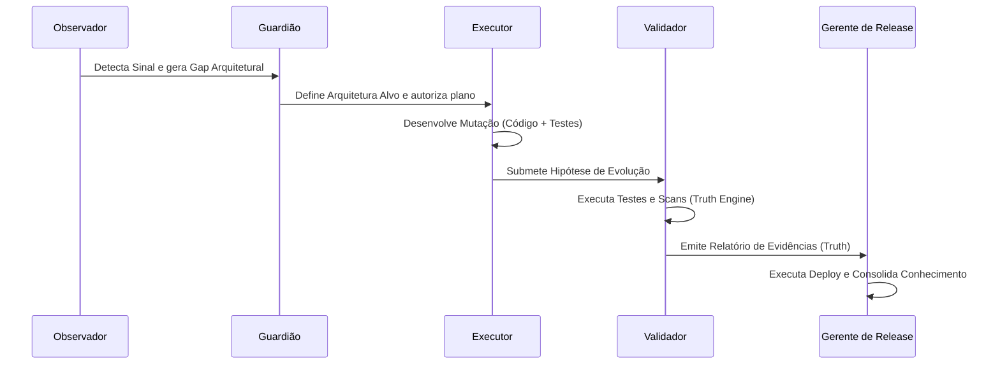

# PROTOCOL_CONCEPTUAL_MODEL.md

# AG47 Evolution Protocol: Modelo Conceitual do Ciclo de Evolução Governada
**Versão:** 1.0.0-draft  
**Status:** Em Revisão Crítica (Fase 2)  
**Domínio:** Engenharia de Software Geral  

---

## 1. Missão e Constituição

O **AG47 Evolution Protocol** é regido por uma **Constituição do Projeto** (`CONSTITUTION.md`). Esse artefato de governança é o ponto de partida absoluto e define as fronteiras de qualquer alteração de software.

O protocolo provê estruturas específicas para modelar e validar as seguintes dimensões constitucionais:

* **Missão do Projeto:** A declaração de propósito de alto nível (ex: "Criar um painel observacional de ativos cripto").
* **Objetivos (Goals):** Metas mensuráveis que definem a direção do desenvolvimento (ex: "Tempo de resposta da API < 100ms").
* **Não Objetivos (Non-Goals):** Declarações estritas do que o sistema **nunca** deve fazer (ex: "Não interagir com chaves privadas on-chain").
* **Restrições (Constraints):** Limites técnicos, de conformidade ou operacionais intransponíveis (ex: "Nenhuma mutação no banco sem sign-off do operador").
* **Princípios Arquiteturais:** Regras fundamentais de design de software (ex: "Separação total entre a UI e a lógica de persistência").
* **Limites de Autonomia (Autonomy Bounds):** Regras de autoridade que barram ações autônomas de agentes de IA, exigindo intervenção humana imediata (ex: "Modificar esquemas de segurança ou alterar dependências principais do projeto").
* **Critérios de Sucesso (Success Criteria):** A definição de pronto (DoD) formalizada para o projeto.
* **Condições de Parada (Stopping Conditions):** Critérios lógicos que forçam a suspensão do pipeline de desenvolvimento (ex: esgotamento de orçamento de API, regressão crítica, ou objetivo alcançado).

---

## 2. Arquitetura

O protocolo opera sobre a premissa de que a evolução de software ocorre através da eliminação progressiva de lacunas (gaps) entre o estado atual e o estado pretendido. A arquitetura é representada por três estados conceituais mapeados em arquivo:

```text
+-----------------------+       +-----------------------+       +-----------------------+
|  Arquitetura Atual    | ----> |    Gap Arquitetural   | ----> |   Arquitetura Alvo    |
|   (As-Is Architecture)|       |   (Architectural Gap) |       | (To-Be Architecture)  |
+-----------------------+       +-----------------------+       +-----------------------+
```

* **Arquitetura Atual (As-Is):** O mapa do sistema conforme ele está implementado hoje, documentado de forma versionada.
* **Arquitetura Alvo (To-Be):** O design de destino desejado. Nenhuma mudança no código pode ocorrer sem que a arquitetura alvo correspondente esteja declarada.
* **Gap Arquitetural:** A diferença exata que precisa ser resolvida. A hipótese de evolução só é válida se atuar diretamente para fechar esse gap.
* **Decisões Arquiteturais (ADRs):** O registro histórico imutável das escolhas técnicas tomadas, justificando desvios e alterações estruturais.
* **Tipos de Mudança:**
  * **Mudanças Permitidas (Permitted Changes):** Alterações locais dentro de componentes já existentes que não violam nenhuma restrição constitucional. Podem ser propostas e executadas de forma semiautônoma (com posterior validação).
  * **Mudanças que Exigem Aprovação Humana (Human Approval Required):** Alterações em contratos de API pública, criação de novas dependências externas, modificações em esquemas de banco de dados, ou alterações de políticas de segurança.

---

## 3. Papéis e Autoridade

A evolução do software é realizada por agentes especializados (humanos ou de IA) que assumem papéis específicos com autoridade estritamente delimitada.

### A. Observador (Observer)
* **Responsabilidade:** Monitorar continuamente o repositório, analisar o estado atual e identificar desvios em relação à Constituição ou lacunas arquiteturais.
* **Entradas:** Arquitetura Atual, Relatórios de Execução de Produção, Logs de Monitoramento, AST do Código.
* **Saídas:** Registro de Sinais (`SignalRegistry`), Lacunas identificadas.
* **Skills Permitidas:** `code-analysis`, `vulnerability-scanning`, `performance-profiling`.
* **Ações Proibidas:** Editar código-fonte, modificar arquivos de plano, executar deploys.
* **Autoridade:** Registrar Sinais e propor revisões de saúde do sistema.
* **Artefatos que Pode Modificar:** `signal_registry.json`.
* **Artefatos que Não Pode Modificar:** Todo o resto.

### B. Executor (Executor)
* **Responsabilidade:** Projetar soluções detalhadas para os gaps arquiteturais e realizar as mutações de código necessárias.
* **Entradas:** Gap Arquitetural, Sinais ativos, Plano Aprovado, Skills de codificação.
* **Saídas:** Hipóteses de Evolução, Código modificado, Diffs de implementação.
* **Skills Permitidas:** `clean-code`, `python-patterns`, `nextjs-react-expert` (conforme a stack).
* **Ações Proibidas:** Aprovar planos de execução próprios, pular validação de testes, modificar a Constituição ou a Arquitetura Alvo.
* **Autoridade:** Propor modificações e escrever arquivos de código em áreas designadas.
* **Artefatos que Pode Modificar:** Código-fonte da aplicação (`apps/`), testes locais.
* **Artefatos que Não Pode Modificar:** `CONSTITUTION.md`, `ARCHITECTURE.md`, `task.md` (fora da sua tarefa), `har_registry.json`.

### C. Validador (Validator)
* **Responsabilidade:** Executar testes, lints, análises estáticas e validar se as mutações propostas pelo Executor satisfazem os critérios de sucesso e as restrições constitucionais.
* **Entradas:** Hipótese de Evolução, Código modificado, Suíte de Testes, Critérios de Sucesso.
* **Saídas:** Relatório de Evidências, Truth status.
* **Skills Permitidas:** `lint-and-validate`, `webapp-testing`, `security-scan`, `verification-patterns`.
* **Ações Proibidas:** Escrever código de produção, modificar planos ou alterar a Constituição.
* **Autoridade:** Rejeitar ou aprovar a transição de estado da mutação (de `IMPLEMENTED` para `VERIFIED`).
* **Artefatos que Pode Modificar:** Relatórios de testes, logs de validação.
* **Artefatos que Não Pode Modificar:** Código de produção, documentação do projeto.

### D. Guardião da Arquitetura (Architecture Guardian)
* **Responsabilidade:** Garantir a conformidade das mudanças sugeridas com a arquitetura alvo e emitir pareceres sobre novos gaps.
* **Entradas:** Hipótese de Evolução, Arquitetura Alvo, ADRs existentes.
* **Saídas:** Parecer de Conformidade Arquitetural.
* **Skills Permitidas:** `architecture`, `vulnerability-scanner`.
* **Ações Proibidas:** Escrever código, alterar o status de testes operacionais.
* **Autoridade:** Barrar hipóteses que quebrem os princípios arquiteturais ou que invadam limites constitutionais.
* **Artefatos que Pode Modificar:** `architecture_gap.md`, `ADR.md`.
* **Artefatos que Não Pode Modificar:** Código de produção.

### E. Curador de Conhecimento (Knowledge Curator)
* **Responsabilidade:** Processar o histórico das mutações, falhas e decisões para refinar continuamente as Skills e a memória do sistema.
* **Entradas:** Truths consolidados, Logs de erros resolvidos, Feedback do operador humano.
* **Saídas:** Skills atualizadas, Diretrizes de Codificação.
* **Skills Permitidas:** `skill-creator`, `doc-coauthoring`.
* **Ações Proibidas:** Escrever código de produção, aprovar deploys.
* **Autoridade:** Modificar e versionar as Skills e arquivos de regras dos agentes no diretório de governança.
* **Artefatos que Pode Modificar:** `.evolution/skills/`, `.evolution/rules/`.
* **Artefatos que Não Pode Modificar:** Código-fonte da aplicação.

### F. Gerente de Release (Release Manager)
* **Responsabilidade:** Controlar o ciclo de integração de novas funcionalidades aprovadas para o ambiente de produção, garantir o isolamento da fila de deploy e gerenciar rollbacks se necessário.
* **Entradas:** Mutações no estado `VERIFIED`, Registros de Ações Humanas concluídos, Changelog acumulado.
* **Saídas:** Release Note, Tag de Versão, Deploy acionado.
* **Skills Permitidas:** `deployment-procedures`, `server-management`.
* **Ações Proibidas:** Modificar lógica de negócios, alterar a Constituição.
* **Autoridade:** Autorizar a transição para `MERGED` e `CLOSED`.
* **Artefatos que Pode Modificar:** `changelog.md`, arquivos de configuração de ambiente de deploy.
* **Artefatos que Não Pode Modificar:** Código-fonte.

---

## 4. Skills

No AG47 Evolution Protocol, o conceito de **Skill** deixa de ser um prompt local e passa a ser definido como um **contrato formal e testável de competência de IA**. Cada Skill deve ser expressa em um diretório isolado contendo uma estrutura rigorosa:

```text
skill-identifier/
├── metadata.json       # Definição e limites do contrato da skill
├── INSTRUCTIONS.md     # Procedimentos operacionais e limites para o agente
├── scripts/            # Scripts executáveis de validação da skill
└── examples/           # Casos de uso de sucesso e falha (One-shot learning)
```

### Contrato Estruturado de uma Skill:

* **Identificador (ID):** Nome único e versionado da skill (ex: `ag47-postgres-optimization-v1`).
* **Objetivo:** O que a skill é capaz de realizar de forma precisa.
* **Entradas:** Os dados ou arquivos que o agente precisa receber para aplicar a skill.
* **Pré-condições:** Estados mínimos do repositório necessários para a skill rodar (ex: "Banco local ativo", "Lint limpo").
* **Ferramentas Permitidas:** A lista restrita de ferramentas de terminal ou APIs que o agente pode chamar sob esta skill.
* **Procedimento:** Passo a passo detalhado que o agente deve seguir para aplicar a competência.
* **Saída Estruturada:** O formato de retorno exigido após a execução (ex: diff de arquivo + relatório de cobertura de teste).
* **Limites:** O que o agente **não** pode fazer ao rodar essa skill (ex: "Não pode instalar pacotes npm adicionais").
* **Casos de Falha:** Exemplos claros de quando a skill deve abortar e retornar o controle ao orquestrador.
* **Testes da Própria Skill:** Scripts de validação offline que provam que a skill funciona corretamente (verificando se ela faz o que promete sem gerar efeitos colaterais).

---

## 5. Workflows

Os fluxos de trabalho são sequências de ações determinísticas executadas pelos papéis autorizados para atingir transições de estado controladas.



* **Workflow de Bootstrap:** Executado no início do projeto. Cria a estrutura `.evolution/`, gera a Constituição inicial e configura o repositório sob o protocolo.
* **Workflow de Adoção:** Mapeia um projeto existente. O Observador realiza um scan inicial e constrói a documentação da Arquitetura Atual (As-Is) e da Constituição sem alterar código.
* **Workflow de Evolução:** O ciclo principal de alteração de código. Inicia com um Gap Arquitetural, passa pela escrita de código pelo Executor e finaliza com a submissão de evidências.
* **Workflow de Validação:** Execução automatizada e isolada do Truth Engine sobre a mutação proposta. Gera o veredito final (sucesso ou falha).
* **Workflow de Recuperação (Rollback):** Acionado automaticamente em caso de regressão operacional ou falha de deploy. Desfaz as últimas mutações e redefine o repositório para o último estado seguro verificado (`VERIFIED` anterior).
* **Workflow de Release:** Agrupamento de mutações verificadas, atualização do changelog, execução de deploy em ambiente de produção e consolidação dos metadados.
* **Workflow de Consolidação de Conhecimento:** Executado após o fechamento da sprint ou incidentes operacionais. O Curador de Conhecimento estuda os logs de erro resolvidos e atualiza as diretrizes de Skills e regras.

---

## 6. Máquina de Estados

O ciclo de vida de qualquer evolução é governado por uma máquina de estados estrita. Cada transição requer a assinatura de um papel autorizado e a presença de evidências imutáveis.

```text
               +--------------------------------------------------------+
               |                                                        |
               v                                                        |
[PROPOSED] -> [APPROVED] -> [IN_PROGRESS] -> [IMPLEMENTED]             |
                                                    |                   |
                                                    v                   |
[REJECTED] <--------------------------------- [TESTED] (Truth Engine)   | (Rollback)
    |                                               |                   |
    v                                               v                   |
[CLOSED]                                      [VERIFIED] (Humano)       |
                                                    |                   |
                                                    v                   |
                                              [RELEASE_CANDIDATE]       |
                                                    |                   |
                                                    v                   |
                                                [MERGED] ---------------+
```

### Detalhamento dos Estados:

1. **PROPOSED (Proposto):**
   * *Definição:* Um Gap Arquitetural ou correção foi identificado pelo Observador.
   * *Pré-condição:* Sinais de falha registrados ou nova diretriz constitucional.
2. **APPROVED (Aprovado):**
   * *Definição:* O plano de evolução foi validado pelo Guardião da Arquitetura e obteve consentimento.
   * *Pré-condição:* Plano de evolução anexado detalhando arquivos alvo.
3. **IN_PROGRESS (Em Progresso):**
   * *Definição:* O Executor assumiu a tarefa e está alterando os arquivos em sua sandbox.
   * *Pré-condição:* Marcação de início registrada em `task.md`.
4. **IMPLEMENTED (Implementado):**
   * *Definição:* As modificações de código foram concluídas pelo Executor.
   * *Pré-condição:* Diff de arquivos gerado e testes unitários propostos anexados.
5. **TESTED (Testado):**
   * *Definição:* A mutação passou pelos testes automatizados no Truth Engine do Validador.
   * *Pré-condição:* Relatório de execução de testes com 100% de sucesso.
6. **VERIFIED (Verificado):**
   * *Definição:* A evolução passou pelo crivo do operador humano e pela auditoria de segurança.
   * *Pré-condição:* Assinatura manual do operador no plano de verificação.
7. **RELEASE_CANDIDATE (Candidato a Release):**
   * *Definição:* O pacote de mutações está integrado na branch de homologação.
   * *Pré-condição:* Testes E2E e scans de segurança integrados executados com sucesso.
8. **MERGED (Integrado):**
   * *Definição:* As modificações foram aplicadas na branch principal de produção.
   * *Pré-condição:* deploy verificado em produção sem falhas de integridade.
9. **CLOSED (Fechado):**
   * *Definição:* A evolução foi encerrada e o conhecimento adquirido foi consolidado.
   * *Pré-condição:* Skills atualizadas pelo Curador de Conhecimento.

### Estados de Exceção:

* **BLOCKED (Bloqueado):** Uma dependência externa ou restrição de runtime impede o avanço.
* **REJECTED (Rejeitado):** O plano foi considerado inválido pelo Guardião ou o código falhou no crivo do Validador/Humano.
* **PARTIAL (Parcial):** O pipeline concluiu apenas parte das tarefas e precisa de intervenção (dados ausentes identificados).
* **REGRESSION (Regressão):** A mutação quebrou funcionalidades preexistentes durante a validação.
* **ROLLED_BACK (Revertido):** O repositório foi retornado ao estado anterior de forma segura.
* **HUMAN_REVIEW (Revisão Humana):** O sistema detectou um conflito lógico que viola a Constituição e requer mediação humana.
* **COMPLETE (Completo):** O estado final pós-consolidação de conhecimento.

---

## 7. Evidências e Verdade

O protocolo não confia em declarações declarativas dos agentes ("Escrevi a classe e está funcionando"). A verdade é dividida em três pilares e exige comprovação fria de integridade:

### As Três Verdades:

1. **Verdade Documental (Documentary Truth):**
   * *O que é:* O registro histórico e a intenção do projeto.
   * *Onde vive:* Arquivos Markdown versionados (Constituição, ADRs, Planos de Evolução).
   * *Como é validada:* Análise de rastreabilidade de requisitos (todo código alterado deve apontar para uma tarefa aprovada).
2. **Verdade de Implementação (Implementation Truth):**
   * *O que é:* A estrutura física e sintática do código-fonte.
   * *Onde vive:* O código-fonte na branch de trabalho.
   * *Como é validada:* Análise estática, AST, verificação de imports circulares, linter e compilador.
3. **Verdade Operacional (Operational Truth):**
   * *O que é:* O comportamento do sistema em ambiente de execução.
   * *Onde vive:* O runtime dos contêineres e scripts de teste.
   * *Como é validada:* Suítes de testes unitários, testes de carga, testes de estresse concorrente, E2E com Playwright e métricas de telemetria.

> **Princípio Fundamental de Validação:**
> Nenhum artefato é considerado "pronto" ou "concluído" por auto-declaração de IA. Uma mutação só transiciona de estado se o Truth Engine de Verificação registrar evidências objetivas e assinadas de teste bem-sucedido.

---

## 8. Colaboração Humano-IA

A evolução contínua é um esforço conjunto. O protocolo formaliza a separação de tarefas em três níveis de capacidade:

* **Executável pela IA:** Tarefas de codificação localizada, geração de testes de unidade baseados em padrões, refatorações cirúrgicas e execução automática de scripts de validação (Linter/Tests).
* **Executável pelo Humano e Validável pela IA:** Mudanças na arquitetura de rede, adição de APIs complexas e modificação do fluxo diário. O humano executa a alteração e a IA valida a integridade lógica e segurança do resultado.
* **Exclusivamente Humana:** Definição da Constituição do projeto, aprovação final de deploys, alteração de regras de autoridade e assinatura de orçamentos ou limites de autonomia.

### Registro de Ações Humanas (Human Action Registry - HAR):

Para evitar que a IA simule sucesso de tarefas que exigem validação manual do operador (como testar um fluxo visual no navegador ou validar uma integração com API externa que exige token físico):

1. **Geração da Ação:** Quando o Executor ou o Observador encontram um ponto que exige verificação humana, eles inserem um item estruturado no `har_registry.json`.
2. **Campos Obrigatórios:** Cada registro do HAR deve conter:
   * `id`: Identificador único da ação.
   * `description`: O que o humano precisa testar e validar de forma clara.
   * `required_evidence`: Qual o formato do retorno esperado (screenshot, log, hash de transação, etc.).
   * `status`: `PENDING` | `COMPLETED` | `FAILED`.
3. **Regras de Encerramento:**
   * A IA **nunca** altera o status de uma ação no HAR para `COMPLETED`. Apenas o operador humano pode fazer essa alteração.
   * O pipeline de evolução fica bloqueado no estado `HUMAN_REVIEW` até que todos os itens pendentes do HAR na sprint atual sejam resolvidos.
   * A IA **nunca simula sucesso** no terminal para satisfazer testes visuais ou de UI. Se a evidência requerida for um screenshot, o arquivo de imagem deve ser colocado fisicamente na pasta de artefatos pelo humano e sua existência/formato verificada pela IA.

---

## 9. Memória Persistente

O protocolo estabelece que o conhecimento acumulado pelo sistema é seu ativo mais importante. Ele rejeita memórias voláteis baseadas em janelas de contexto de chat e exige a persistência de metadados de evolução diretamente no sistema de controle de versão (Git):

* **Diretório de Persistência:** `.evolution/memory/` e `.evolution/knowledge/`.
* **Histórico de Decisões (Decision Log):** Gravação imutável de todas as hipóteses propostas, aprovadas e rejeitadas, acompanhadas da justificativa e dos relatórios de testes associados.
* **Histórico de Sprints (Sprint Ledger):** Metadados de cada sprint contendo o gap inicial, as mutações aplicadas, as ações humanas resolvidas e os relatórios de validação de produção.
* **Acurácia e Confiança de Conclusões:** O Curador de Conhecimento registra a correlação de previsões de falhas. Se um linter ou padrão de arquitetura sugerido pela IA gerou regressões repetidamente, a confiança nessa Skill é penalizada no `skills_registry.json` e seu uso é suspenso para novas mutações até ser reformada.

---

## 10. Função de Parada (Stopping Function)

Para evitar loops de refinamento infinito (onde a IA fica indefinidamente refatorando código sem necessidade real) ou execuções cegas que quebram o sistema, o protocolo define condições formais de encerramento do ciclo:

* **Não há mudança necessária:** O estado atual (As-Is) atende completamente à arquitetura alvo (To-Be) e todas as invariantes da Constituição estão satisfeitas.
* **Projeto Bloqueado (Blocked):** Uma ferramenta necessária falhou, um circuit breaker operacional de segurança foi acionado, ou existe violação estrutural irrecuperável. O sistema entra no estado `BLOCKED` e suspende operações.
* **Necessária Decisão Humana:** Quando o sistema encontra ambiguidade constitucional (duas regras contraditórias, como "otimizar desempenho de rede" vs "manter limite rígido de chamadas a provedores").
* **Risco supera o benefício:** A taxa de falha de mutações recentes no mesmo componente excede o limite estabelecido no controle de riscos.
* **Pronto para Release:** O sistema passou por 100% dos testes, não possui pendências no HAR e atende aos critérios de DoD.
* **Objetivo Atingido:** O Sprint Ledger registra a entrega completa das metas associadas ao gap planejado.

---

## 11. Revisão Crítica dos Quatro Contratos Iniciais

Avaliamos criticamente os quatro contratos de dados propostos na primeira versão do relatório de descoberta (`CodeSnapshot`, `CodeMutationEvent`, `EvolutionHypothesis`, `ValidationTruth`):

1. **Avaliação de Nomes:** Os nomes originais induzem a IA a olhar apenas para o código-fonte brutos, negligenciando a governança, as intenções humanas e a arquitetura.
2. **Centralização em Código:** Sim, eles estão excessivamente centrados na árvore sintática e nos deltas de arquivos, falhando em representar o contexto de governança (sprints, ações humanas, limites de autoridade).
3. **Reformulação Proposta (Mais Universais):**
   * **CodeSnapshot** $\rightarrow$ **SystemSnapshot:** Deve conter não apenas a árvore de arquivos, mas o estado de saúde do sistema (status de execução, circuit breakers ativos, configurações vigentes).
   * **CodeMutationEvent** $\rightarrow$ **EvolutionEvent:** Deve cobrir qualquer alteração no ecossistema (modificação no código, alteração na documentação, execução de comando de infraestrutura, ou registro de sinal).
   * **EvolutionHypothesis** $\rightarrow$ **ProposedChangeset:** Representa a proposta de alteração contendo a hipótese técnica de evolução, o plano de arquivos que serão modificados e as expectativas de validação associadas.
   * **ValidationTruth** $\rightarrow$ **IntegrityVerdict:** O relatório compilado de evidências que aprova ou rejeita a mutação, unindo a verdade de implementação (linter/compilador) e a verdade operacional (testes concorrentes/E2E).
4. **Contratos Adicionais Necessários:**
   * **HumanActionEntry:** Representação no HAR das ações de testes manuais e assinaturas humanas.
   * **ArchitectureGapState:** O delta formal de transição entre a arquitetura atual e a arquitetura alvo.
   * **SkillContract:** A especificação estruturada de uma competência habilitada para uso dos agentes.
