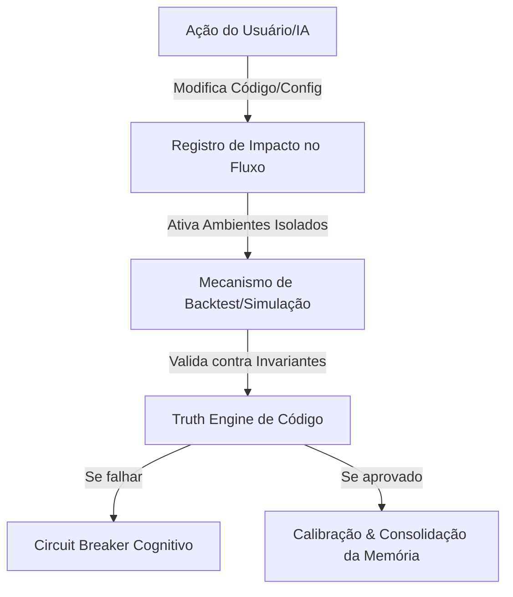

# PROTOCOL_DISCOVERY_REPORT.md

# AG47 Evolution Protocol: Relatório de Descoberta e Teoria Geral
**Autor:** Antigravity (AI Coding Specialist) & AG47 Team  
**Data:** 6 de Agosto de 2026  
**Contexto:** Transição do laboratório Altcoin Radar para o protocolo geral de evolução contínua de software.  

---

## 📋 Introdução & Contextualização

O **AG47 Altcoin Radar** foi construído como o primeiro laboratório prático da AG47. Ele foi projetado como um **Lóbulo Especializado** (o "cardiologista" de altcoins) focado em extrair, processar e normalizar conhecimento sobre criptoativos. Ao longo de 13 sprints bem-sucedidos, implementamos desde a interface Next.js 16 até motores complexos de backtesting, calibração dinâmica de scoring, filas de notificações e circuit breakers.

No entanto, o maior valor gerado pelo Radar não está na sua capacidade de escanear blockchains. O verdadeiro valor reside na **metodologia e nos mecanismos operacionais** que permitiram ao sistema evoluir com segurança, resiliência e documentação impecável sob a ação coordenada de agentes de Inteligência Artificial e operadores humanos.

Este relatório realiza a engenharia reversa do Radar, separando a lógica de negócios DeFi (o domínio de criptoativos) da lógica de engenharia de sistemas (o domínio universal de evolução de software). O objetivo é propor a fundação teórica e arquitetural para o **AG47 Evolution Protocol**.

---

## 1. O que o Radar ensinou sobre evolução de software?

### A. O valor da memória persistente sobre heurísticas transitórias
Modelos de IA geram código e tomam decisões heurísticas baseadas em contextos locais e efêmeros. Sem um repositório de memória persistente e estruturada de decisões, a IA entra em loops de retrabalho ou degrada o código pré-existente.
* **O aprendizado no Radar:** As heurísticas de scoring dependem de pesos que mudam com base em dados de mercado reais. Em vez de codificar pesos de forma estática no backend, o sistema passou a persistir e calibrar as matrizes de peso (`ScoringWeights`) via backtest periódico, com aprovação explícita do operador. O mesmo princípio aplica-se ao desenvolvimento: as regras de estilo, lint e padrões arquiteturais da IA devem ser persistidas como **Skills modulares e versionadas**, e não como instruções fixadas no prompt do modelo.

### B. Epistemologia Incremental de Código (A Escada de Evidências)
O código não se torna "estável" ou "correto" apenas porque foi gerado sem erros de sintaxe. A evolução de software exige uma comprovação empírica e gradual de qualidade.
* **O aprendizado no Radar:** Criamos uma escada epistemológica clara:
  $$\text{Snapshot} \rightarrow \text{Event} \rightarrow \text{Signal} \rightarrow \text{Hypothesis} \rightarrow \text{Truth} \rightarrow \text{Knowledge}$$
  No domínio de software, essa escada nos ensina que uma alteração proposta (Hypothesis) precisa ser submetida a testes operacionais, testes de concorrência e auditorias (Truth) antes de ser consolidada na base de conhecimento e diretrizes da IA (Knowledge).

### C. O Gatekeeper Humano (Human-in-the-Loop com Assinatura)
Sistemas autônomos puros tendem a derivar para a entropia. A IA deve sugerir e simular de forma offline e isolada, mas a aplicação prática na realidade operacional requer consentimento expresso e assinatura humana.
* **O aprendizado no Radar:** No Sprint 13, a otimização de pesos por *Grid Search* roda offline sem afetar o banco principal. O sistema exibe o comparativo de desempenho e aguarda o aceite manual do operador. Transposto para o protocolo de evolução de software, a IA deve rodar propostas de refatoração, correções de bugs e migrações em ambientes efêmeros (sandboxes), provendo relatórios comparativos estruturados antes do merge definitivo.

### D. Resiliência por Design (Circuit Breakers Cognitivos)
Integrações externas (APIs de terceiros ou APIs de LLMs) são instáveis por definição. A degradação de um provider não deve derrubar o sistema ou travar o fluxo cognitivo da IA.
* **O aprendizado no Radar:** Criamos o mecanismo de **Circuit Breakers** para os provedores HTTP (DexScreener, GoPlus, RugCheck), permitindo que a aplicação isole falhas e exiba estados degradados explicitamente na UI. Na evolução de software baseada em IA, se uma ferramenta de análise (ex: SonarQube, security scanner ou o próprio provedor de IA) falhar ou estiver indisponível, a esteira de evolução do software deve entrar em modo degradado seguro, em vez de falhar silenciosamente ou corromper a base de código.

---

## 2. Quais padrões surgiram naturalmente?

Vários padrões de engenharia emergiram espontaneamente durante a construção do Radar e provaram-se cruciais para a estabilidade do sistema:



### A. Registro de Ações do Dev e Impacto no Fluxo
A documentação de transição de ambiente em `docs/acoes-do-dev.md` e a rastreabilidade diária em `docs/fluxo-diario.md` criaram um contrato síncrono. Toda alteração de lógica do software obriga a atualização imediata do fluxo operacional. Isso evita o desalinhamento entre o que o código faz e o que o desenvolvedor humano/IA assume que ele faz.

### B. Confiança e Explicabilidade de Múltiplos Fatores
O score final de oportunidade não é apenas um número mágico. Ele expõe a confiança (penalizada se houver dados ausentes) e o detalhamento individual de cada componente (breakdown). Na evolução de software, a prontidão de produção de um código deve ser medida por um score composto explicável (ex: cobertura de testes + ausência de vulnerabilidades + conformidade de lint + auditoria de acessibilidade).

### C. Execução e Varredura Offline (Grid Search de Decisões)
A capacidade de testar múltiplos cenários contra dados históricos salvos sem poluir a persistência de produção. Esse padrão é essencial para validar se uma mudança arquitetural proposta não quebrará comportamentos legados (uma forma avançada de regressão baseada em simulação).

### D. Interface de Normalização de Provedores
Isolar todas as chamadas de infraestrutura sob contratos estritos de interface. Isso permitiu que o Altcoin Radar alternasse dinamicamente entre dados fictícios (`DEMO_MODE=true`) e dados reais de mercado (`DEMO_MODE=false`) sem que o frontend ou os serviços de scoring precisassem conhecer os detalhes da chamada de rede.

---

## 3. O que é específico do Radar vs. O que é Universal?

A tabela abaixo separa os conceitos do domínio financeiro de criptoativos dos princípios de engenharia de software que devem compor o protocolo geral:

| Conceito no Radar | Domínio | Abstração Universal (AG47 Evolution Protocol) |
| :--- | :--- | :--- |
| **Token / TradingPair** | Criptoativos | **Entity / Software Component** (A unidade estável sob evolução). |
| **Snapshot de Liquidez/Preço** | Criptoativos | **Code Snapshot / AST State** (O estado estático do código em T). |
| **Eventos de Rede (Pool Criado)** | Criptoativos | **Code Mutation Event** (Modificação, commit, adição de dependência). |
| **Sinal (liquidity_volume_expansion)** | Criptoativos | **Analysis Signal** (Falha em testes, erro de compilação, alerta de segurança). |
| **Hypothesis (Preço subirá > 5%)** | Criptoativos | **Evolution Hypothesis** (A proposta de alteração de código para resolver o sinal). |
| **Truth (Medição empírica após 24h)** | Criptoativos | **Truth Validation** (Resultados reais da compilação, testes e conformidade). |
| **Knowledge (Acurácia de heurísticas)** | Criptoativos | **Cognitive Memory / Skill** (Consolidação de regras e boas práticas aprendidas). |
| **Paper Trading / Carteira Virtual** | Criptoativos | **Staging Environment / Ephemeral Sandbox** (Simulação do impacto em isolamento). |
| **Scoring de Oportunidades** | Criptoativos | **Quality Score** (Métrica composta da saúde estrutural do software). |
| **Circuit Breaker (DexScreener API)** | Criptoativos | **Tool Circuit Breaker** (Tratamento de timeout de linter/segurança/IA). |

---

## 4. O que ainda falta para o protocolo existir?

Para que o **AG47 Evolution Protocol** deixe de ser um conjunto de diretrizes no Altcoin Radar e nasça como um ecossistema independente, precisamos desenvolver:

1. **CLI de Bootstrap e Inicialização:** Uma ferramenta de linha de comando para instalar e configurar as diretrizes básicas de evolução de software em qualquer repositório (ex: `npx ag47-evolution init`).
2. **Motor AST de Eventos de Código:** Um analisador que traduza commits e edições não apenas como linhas de texto adicionadas/removidas (diff bruto), mas como alterações semânticas em funções, classes ou esquemas de banco de dados (Event Sourcing de Código).
3. **Esquemas JSON Universais:** Especificar contratos formais para os artefatos de evolução. Exemplos:
   * `event.schema.json`: O formato que descreve uma alteração ou sinal detectado.
   * `hypothesis.schema.json`: A estrutura de uma proposta de modificação (incluindo testes esperados e impactos planejados).
   * `skill.schema.json`: Como regras de codificação personalizadas de IA são formatadas e injetadas de forma dinâmica.
4. **Agente Orquestrador Agnóstico de Engine:** Criar a infraestrutura de agentes que não dependa de uma IDE ou provedor de IA específico, funcionando via Model Context Protocol (MCP) padrão.

---

## 5. Qual deve ser a arquitetura do AG47 Evolution Protocol?

O protocolo operará em 4 camadas modulares e desacopladas, focadas em monitorar, propor, testar e consolidar a evolução do software:

```text
+-----------------------------------------------------------------------+
|                       Camada de Governança (Humano)                  |
|          [Aprovação / Sign-off]    [Configurações de Políticas]       |
+------------------------------------+----------------------------------+
                                     |
                                     v
+------------------------------------+----------------------------------+
|                       Camada Cognitiva (Agentes/IA)                  |
|         [Orquestrador]   [Skills Modulares]   [Socratic Gate]        |
+------------------------------------+----------------------------------+
                                     |
                                     v
+------------------------------------+----------------------------------+
|                    Camada de Verificação (Truth Engine)              |
|        [Linter/AST Scanner]   [Test Runner]   [Security Audit]        |
+------------------------------------+----------------------------------+
                                     |
                                     v
+------------------------------------+----------------------------------+
|                   Camada de Observabilidade (Código)                 |
|       [Snapshot de Arquivos]   [Deltas/Commits]   [Métricas/Logs]    |
+-----------------------------------------------------------------------+
```

### As 4 Camadas do Protocolo:

1. **Camada de Observabilidade (Observability Layer):**
   * Coleta dados brutos sobre a base de código e seu ambiente de desenvolvimento.
   * Produz **Code Snapshots** e identifica **Code Mutations** (Events).
2. **Camada de Verificação (Verification Layer / Truth Engine):**
   * Executa scanners estáticos, suítes de teste de unidade/integração/E2E, e testes de estresse.
   * Transforma eventos brutos em **Signals** (ex: regressões, quebras de estilo, vulnerabilidades de segurança).
   * Valida se a solução proposta atinge o resultado esperado (Truth status).
3. **Camada Cognitiva (Cognitive Layer):**
   * Consome as Skills e diretrizes de projeto.
   * Propõe alterações de código e planos de correção (**Hypothesis**).
   * Implementa o **Socratic Gate** para alinhar trade-offs arquiteturais antes da escrita de código.
4. **Camada de Governança (Governance Layer):**
   * Provê o console de controle do operador humano.
   * Permite aprovar alterações propostas pela Camada Cognitiva (Sign-off) e configurar as políticas de evolução (severidade de lints, requisitos de cobertura de teste, caminhos proibidos).

---

## 6. Quais riscos existem em simplesmente copiar a arquitetura atual?

Copiar de forma direta a estrutura física do Altcoin Radar para o repositório do protocolo trará problemas graves de acoplamento:

* **Acoplamento Tecnológico (Framework Lock-in):** O Radar está atrelado ao ecossistema Python (FastAPI, SQLAlchemy, SQLite/PostgreSQL) e JavaScript/TypeScript (Next.js 16, React Server Components). O protocolo universal de evolução de software **não deve assumir nenhuma tecnologia específica**. Ele deve ser capaz de gerenciar um sistema legado em C#, um microsserviço em Go ou um monorepo em Rust.
* **Poluição Semântica de Domínio:** A mistura de terminologias de tokens, redes blockchain e alertas financeiros nas diretrizes de IA impediria a reutilização do protocolo em domínios tradicionais (ex: SaaS corporativo, e-commerce, portais públicos).
* **Dependência do Ambiente de Execução Local:** Os scripts de validação (`checklist.py`, `verify_all.py`) dependem da existência de instaladores de pacotes específicos (`uv`, `npm`) e estruturas de diretórios fixas. O protocolo deve expor adaptadores flexíveis para invocar os linters e runners de teste nativos de cada projeto.

---

## 📅 Próximos Passos (Roadmap de Execução)

Com a aprovação deste relatório pelo operador, iniciaremos a transição em fases estruturadas para garantir a máxima abstração e qualidade da base:

* **Fase 1: Descoberta [CONCLUÍDO]**
  * Produção do `PROTOCOL_DISCOVERY_REPORT.md` (Este documento).
* **Fase 2: Extração & Definição de Esquemas**
  * Criação dos contratos universais de dados (esquemas JSON de Snapshots, Events, Signals, Hypothesis, Truth, Knowledge).
* **Fase 3: Generalização**
  * Construção do design de papéis (Agentes) e da estrutura física independente do repositório `AG47 Evolution Protocol`.
* **Fase 4: Construção**
  * Inicialização da nova estrutura de diretórios e escrita da especificação técnica detalhada, README global, templates de regras, fluxos de validação progressiva e scripts de bootstrap.

---

## 📢 Solicitação de Feedback do Operador

Para garantir o alinhamento total com a visão do protocolo de evolução contínua, solicitamos que o operador avalie as seguintes definições:

1. **A Abstração Epistemológica:** A transição da escada de evidências do Radar (Snapshot de mercado -> Truth de preço) para o domínio de software (Snapshot de código -> Truth de testes/compilação) captura a essência do que buscamos em evolução contínua de software?
2. **Camadas Arquiteturais:** A separação em 4 camadas (Observabilidade, Verificação, Cognitiva e Governança) atende aos requisitos de independência de linguagem e domínio?
3. **Autorização para Fase 2:** Podemos avançar para a criação e organização das diretórios estruturais do repositório `AG47 Evolution Protocol`?

---
> **Preservação de Conhecimento:** Este documento foi gerado incrementalmente a partir da análise dos arquivos históricos de Sprints 1 a 13 e do motor arquitetural do laboratório. Nenhuma informação consolidada foi alterada ou removida sem embasamento técnico.
