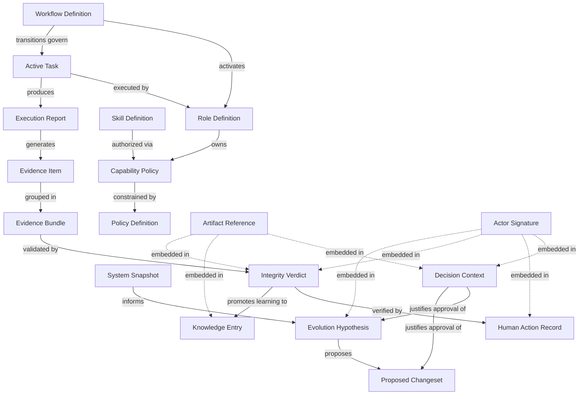

# Protocol Relationship Map

Este documento mapeia o ecossistema atual de 22 schemas do AG47 Evolution Protocol, demonstrando as relações de posse, restrição, ativação e produção entre eles. Este é o mapa de como os objetos de governança, memória e execução se conectam.

## Dependências Diretas e Acoplamentos
1. **Decision Context → Artifact**: Um `decision-context` nunca existe flutuando. Ele é obrigatoriamente acoplado a uma decisão que escolheu um `chosen_path_ref` específico.
2. **Knowledge Entry → Verdict**: O aprendizado (`knowledge-entry`) tem como origem o `source_verdict_ref`. IA não pode inventar conhecimentos sem que tenha ocorrido uma verificação baseada em evidência.
3. **Workflow → Role**: Transições no `workflow-definition` (`allowed_actors`) dependem estritamente da existência do papel correspondente no `role-definition`.
4. **Task → Execution Report**: Uma `active-task` que transiciona para "COMPLETED" deve possuir uma referência para um `execution-report`.

## Alertas de Consistência (Pontos de Fricção Potencial)
- O `proposed-changeset` define restrições estruturais, mas não conhece o `policy-definition`. O cruzamento "mudança vs política" exigirá avaliação via runtime.
- Um `actor-signature` presente no `execution-report` precisará ser verificado no runtime contra a `capability-policy` para garantir que quem assina tinha permissão para atuar naquele contexto de artefato.
